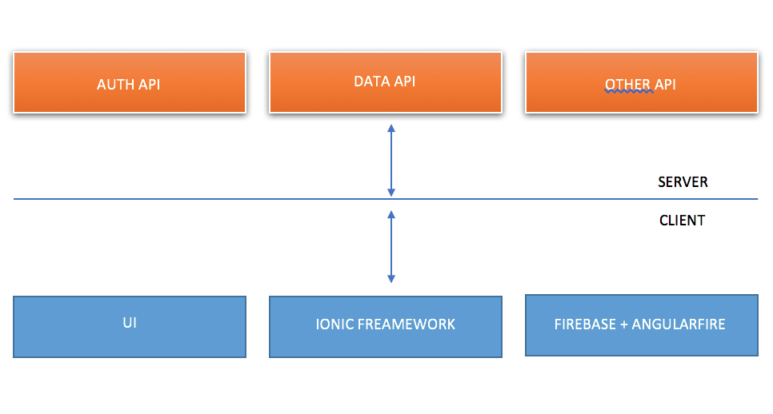

## 5.0	Requirements Specification

## 5.1	Introduction

This Software Requirements Specification (SRS) documents the requirements for a mobile application called Reppy. Reppy is an application that lets its user to follow the restaurant reviews of only family, friends or anyone of user’s choosing. The app has three pages: Home, Profile and Search. In the Home page, users will be able to browse reviews of restaurant that reviewed by people they are following. The Profile page will contain the user’s own reviews, number of posts, number of followers and number of people the user is following. The Search will let users to find family, friends or people users would like to follow.

Reppy system architecture is comprised of  two layers. The first is the client(Ionic), and the second is the server(Firebase). On the client side there is an Angular fire layer which interacts with Firebase and acts as a service layer for the application. It is this layer that gives the power to keep the data in sync between the server (Firebase) and the client.

	

## Outline of Requirements Specifications
- 5.2	CSCI Component Breakdown
- 5.3	Functional Requirements by CSC
- 5.4	Performance Requirements by CSC
- 5.5	Project Environment Requirements
	- 5.5.1	Development Environment Requirements
	- 5.5.2	Execution Environment Requirements

### 5.2 	CSCI Component Breakdown
- 5.2.1		Reppy Frontend CSC -- GUI components that the user will interact with
	- 5.2.1.1		Login Page CSU -- modules for accessing the system
		- 5.2.1.1.1	Login input module -- input fields for user credentials
		- 5.2.1.1.2	Login button module -- buttons to submit inputs to server
		- 5.2.1.1.3	Post New Restaurant Review module --
			- 5.2.1.1.3.1	Input fields for pictures and comments
			- 5.2.1.1.3.2	Submission
		- 5.2.1.1.4	Delete Post module --
	- 5.2.1.2		Home Page CSU -- page that browses other users' posts
	- 5.2.1.3		Profile CSU -- page that browses the user's own posts
	- 5.2.1.4		Search CSU -- modules for searching other users
		- 5.2.1.5.1	Search bar module -- input fields for user searches
	- 5.2.1.6		Settings CSU -- modules for configuring user settings for the mobile app
		- 5.2.1.6.1	Notifications CSU -- modules for handling notifications from the mobile app
	- 5.2.1.7		Troubleshoot CSU -- modules for troubleshooting the system

- 5.2.2		Firebase CSC -- server components that will host the Frontend

### 5.3	Functional Requirements

Reppy will allow its user to follow the restaurant reviews of only family, friends or anyone of user’s choosing. Users will have the ability to post reviews of restaurant and follow other users to browse their reviews.

- 5.3.1	Frontend
- 5.3.1.1		The Frontend shall display an initial login page.
- 5.3.1.2		The Frontend shall provide instructions for how to use the login page.
- 5.3.1.3		The Frontend shall provide text entry fields into which the user may type values.
- 5.3.1.4		The Frontend shall provide error checking on the text entry fields such that the user is provided immediate feedback in case of erroneous entry.
- 5.3.1.5		The Frontend shall direct users with different levels of access to different pages.
- 5.3.1.6		The Frontend shall include a navigation bar at the top of the page.
- 5.3.1.7		The Frontend shall have menus for navigating between pages and content.
- 5.3.1.8		The Frontend shall have a search page for finding other users.
- 5.3.1.9		The Frontend shall have a profile page for browsing user's own information.
  - The profile page shall have user's restaurant review history.
  - the profile page shall have the number of user's followers.
  - the profile page shall have the number of user's previous posts.
  - the profile page shall have the number of users that the user is following.
- 5.3.1.10	The Frontend shall react to mouse clicks on displayed buttons.
- 5.3.1.11	The Frontend shall display real-time data.
- 5.3.1.12 	The Frontend shall have a home page.
	- 5.3.1.12.1	The home page shall have a list of restaurant reviews that reviewed by the user's followers.

- 5.3.2	Backend
- I have not learned Firebase so I will complete this part when I learn it.

- 5.3.3	System-wide
	- 5.3.3.1		The system shall provide a means for retrieving lost password information.
	- 5.3.3.2		The system shall provide a means for resetting user passwords.
	- 5.3.3.3		The system shall provide a means for troubleshooting connection errors.
	- 5.3.3.4		The system shall provide a means for creating a new restaurant reviews.
	- 5.3.3.5		The system shall provide a means for following a new user.
	- 5.3.3.6		The system shall provide a means for editing existing user profile information.
	- 5.3.3.7  	The system shall provide a means for deleting existing user profile information.

### 5.4	Performance Requirements

- 5.4.1	Successful login occurs within 5 seconds:
Upon entering credentials, the user should not have to wait more than 5 seconds to be redirected to the home page upon successful verification of those credentials.

- 5.4.2	Nearly instantaneous navigation:
Users should not experience delays in navigating between pages.

- 5.4.3	Usability design principles for the Frontend:
The graphical user interface shall be human-friendly and intuitive.

### 5.5	Project Environment Requirements

Utilizing pre-built frameworks such as Ionic and using Firebase will expedite development and provide more secure and stable server-side hosting.

#### 5.5.1	Development Environment Requirements

| Category | Requirement |
|---|---|
| Front End | Ionic, AngularJS,  |
| Server | Firebase |
