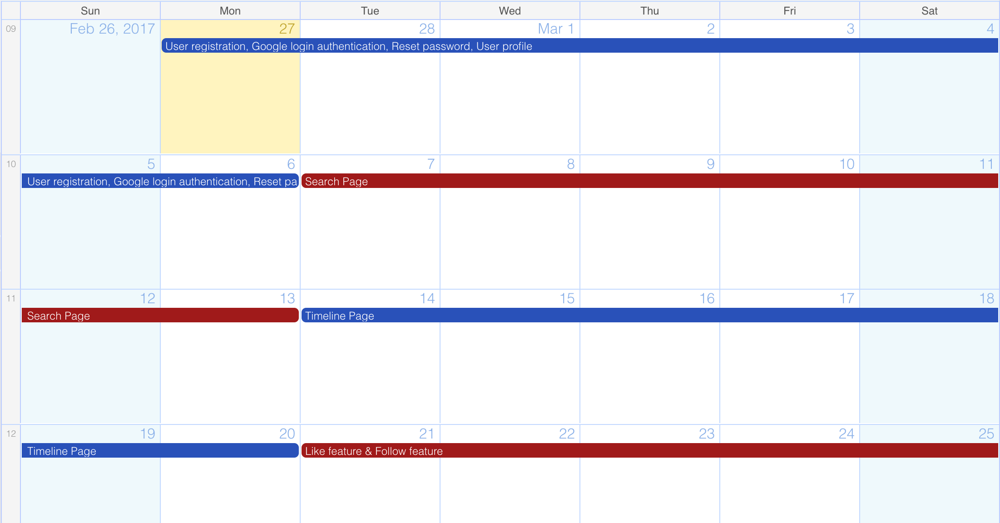
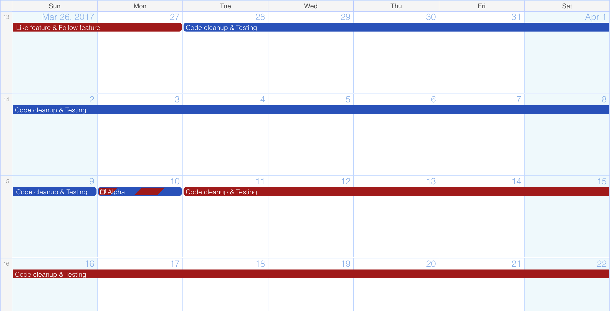
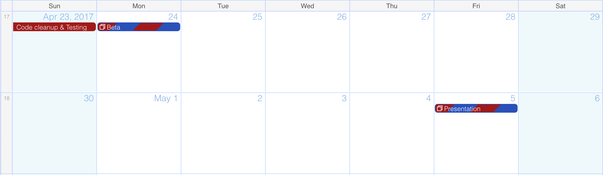

#4.0 Software Development Plan

##4.1 Plan Introduction

###4.1.1 Project Deliverables

- _Alpha - April 10th_ - Preliminary version of the app.
- _Beta - April 24th_ - Publish the app in the Google Play Store.

##4.2 Project Resources

###4.2.1 Hardware Resources

Resource           | Development   | Execution
------------------ | ------------- | -----------
Macbook Computer   | ✓             |
iPhone             |               | ✓
Android Phone      |               | ✓
Windows Phone      |               | ✓
2 GB RAM           | ✓             | ✓
16 GB Storage      | ✓             | ✓
screen             | ✓             | ✓
Wifi connection    | ✓             | ✓
Ethernet connection | ✓            |
Intel or ARM processor | ✓         | ✓

###4.2.2 Software Resources

Resource              | Development   | Execution
--------------------- | ------------- | -----------
Google Chrome         | ✓             |
Atom Text Editor      | ✓             |  
macOS                 | ✓             | ✓
Windows OS            | ✓             | ✓
Android OS            | ✓             | ✓
Firebase              | ✓             |
GitHub                | ✓             |

##4.3 Project Schedule

###4.3.1 GANTT Chart

## 4.4 User Manual

Installation and running instructions are on [README](../README.md)
Users can use their username and password credentials to login to the application from the login page.
